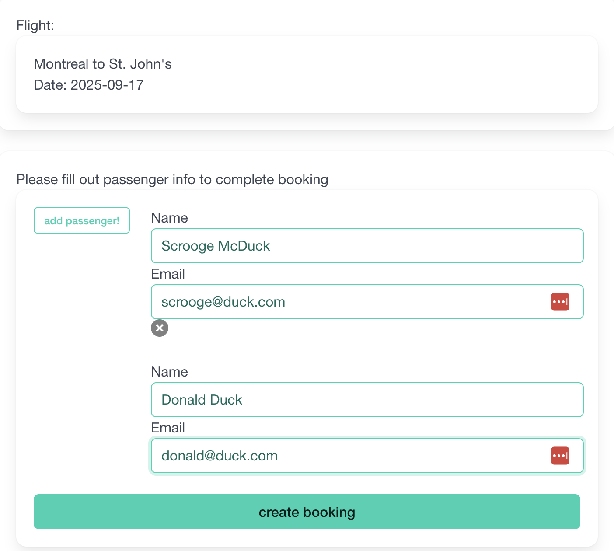

# Flight-Booker

This is a project created while following the Odin Project Ruby on Rails Curriculum. View the lesson details here:[flight booker](https://www.theodinproject.com/lessons/ruby-on-rails-flight-booker)

Visit the live deployment [here](https://flight-booker-gdhm.onrender.com/) (Please give time for the app to load!)

## Goals

The main purpose of this project is to gain experience with advanced forms. The app was built to simulate the steps of a typical fligh checkout process for booking a one-way flight. 

I have since revisited this project to add in dynamic JS to the booking forms with Stimulus, and to add confirmation e-mail functionality.

## Usage
- Enter desired dates and origin/destination airports, and search for available flights
- Choose from the list of flights

- Enter passenger information for passenger. - Additional passengers can be added with the "add passenger" button.

- user is brought to the booking info page, where you can book another flight. 

- DEVELOPMENT ONLY: confirmation e-mail is sent to each passenger.

## Tech Stack

- Ruby on Rails
- Postgres
- Stimulus/Hotwire (nested forms, dynamic passenger fields)
- Bulma/CSS
- Mailers/letter opener

## Future Improvements

- User Accounts
- Confirmation e-mail working for live deployment (currently only works in development ENV)